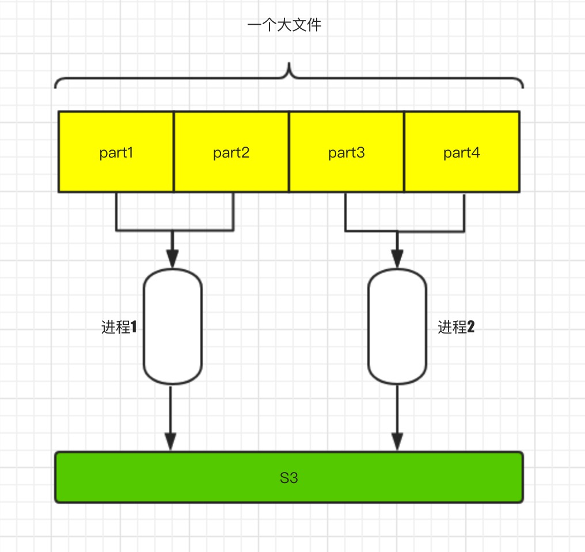
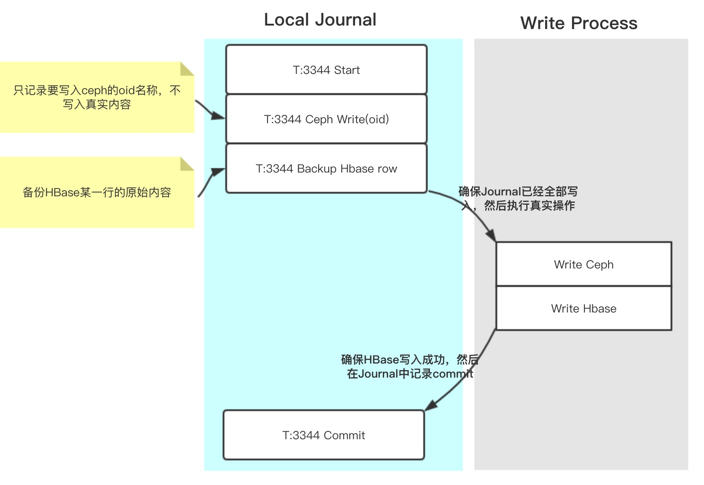

# yig如何保证数据一致性？

有人问到了这个问题， 如果在上传的过程中，yig的实例crash或者yig所在的服务器宕机，有可能造成
Ceph中的object与HBase里面记录的object对应的元数据不一致.

如果是下载的情况，由于是只读, 不会造成不一致的情况.

我们先讨论上传的方式，再讨论如何在技术上做到Ceph和HBase的数据一致性. 最终会给出证明，在yig的特殊
应用中, 也可以实现一种在线recovery. 有如下特点:

1. 支持online的recovery, 不影响整体系统
2. 采用本地journal 性能损失非常小
3. 无锁实现, 不依赖分布式锁


# S3上传的方式

[S3 API](http://docs.aws.amazon.com/AmazonS3/latest/API/Welcome.html)主要支持2种对象上传的方式, 一种是
[普通上传](http://docs.aws.amazon.com/AmazonS3/latest/API/RESTObjectPUT.html), 另一种是[分片上传](http://docs.aws.amazon.com/AmazonS3/latest/API/mpUploadInitiate.html). 其中普通上传适合上传小文件，API也简单，但是缺点是不能续传，如果上传失败，yig会在后台自动清理垃圾文件. 分片上传适合上传大文件, API要复杂一些，但是可以很好的支持续传和并发上传，

它是这么工作的:

1. S3客户端发起[initial upload](http://docs.aws.amazon.com/AmazonS3/latest/API/mpUploadInitiate.html)的请求 <---> S3服务端返回一个uploadID

2. S3客户端把要上传的大文件按照每个不小于5MB的大小切割，分成多个part,
每个part独立发起请求上传,比如有一个13MB的文件，这个上传就需要有3个part,
所以上传请求就是一个[part upload](http://docs.aws.amazon.com/AmazonS3/latest/API/mpUploadUploadPart.html)
S3客户端发起请求，包括part号，文件数据，之前申请的uploadID <---> 服务端存储数据，并返回成功和这个part对应的tag号

part上传的http请求例子:

```
PUT /ObjectName?partNumber=PartNumber&uploadId=UploadId HTTP/1.1
Host: BucketName.s3.amazonaws.com
Date: date
Content-Length: Size
Authorization: authorization string
BODY

```

可以从这里面清楚得看到ObjectName, partNumber， uploadID这几个需要的数据. 所以针对一个13MB的问题，需要发送3次
这个的http请求才可以完成上传,分别上传5MB, 5MB, 3MB

3. 最后一步，S3客户端发现所有的part请求都已经成功, 发起[complete upload](http://docs.aws.amazon.com/AmazonS3/latest/API/mpUploadComplete.html)

所以只有上面3个步骤全部做完，才可以说一个文件上传完成. 所以调用的API次数多了很多，但是它可以很好的支持断点续传和并发上传.

## S3断点续传的情况

1. S3客户端已经知道UploadId, 调用[list part](http://docs.aws.amazon.com/AmazonS3/latest/API/mpUploadListParts.html)API检查
已经上传成功的part有哪些
2. S3对比本地文件和list part返回的信息，知道还有哪些part没有上传，直接上传那些缺失的part
3. part上传完毕后，发起[complete upload](http:////docs.aws.amazon.com/AmazonS3/latest/API/mpUploadComplete.html)


## S3并发上传的情况:



如果这个20MB的文件分成4个part, 前2个part交给进程1, 后面2个part交给进程2, 由于每个part之间没有相互依赖，所以可以把一个大文件拆成很多小的part，用单独的线程上传，甚至为了提高带宽，可以放到多台服务器上上传，最后检查每个part都成功了,


所以，从上面可以看出，
1. 在普通上传的情况下，如果采用先写Ceph对象， 再写入HBase的元数据的方式，如果在写Ceph的对象时, 但还没有来得及写HBase中的元数据, 正在写入的Ceph对象没有记录进元数据， 会导致Ceph对象如同泄露了一般，一直占用存储空间，但是没有人能找到它
2. 在分片上传的情况中，由于S3协议的要求，我们有每一个part对于与整体的关系，即使在上传某一个part时，yig的实例crash, 但是泄露的仅仅是这一片part, 大大见效的泄漏的大小，但是问题仍然存在.


# 哪种情况会引发数据不一致？

用户上传一个名为myfavoriteMovie.mp4, 代码的逻辑如下:

写入:
```
1. yig接受请求，针对myfavoriteMovie.mp4生成一个唯一的oid,比如"oid:1233:12", 其中生成这个oid的算法和radosgw中的算法类似.由HBase记录和维护myfavoriteMovie.mp4和oid之间的对应关系，比如如果myfavoriteMovie.mp4非常大，可能需要多个Ceph object拼成一个myfavoriteMovie.mp4文件.
2. 调用Ceph的rados接口radoWrite(oid, buf, bufsize);
3. 如果写入成功，在HBase的元数据区域，记录myfavoriteMovie.mp4对应Ceph文件为oid:1233:12
```


读取myfavoriteMovie.mp4:
```
1. yig查询HBase, 找到myfavoriteMovie.mp4对于的Ceph的对象名称为oid:1233:12
2. 调用rados_read接口，向用户返回文件内容
```

很容易发现里面有一些需要进行错误处理的情况

1. 用户上传到一半，主动中断上传

这种情况不会出现任何的不一致，因为yig会发现远程的http连接中断，但是收到的数据不足够part的大小，它会认为上传失败，
会自动清理上传了一半的Ceph对象

2. 用户上传到一半，用户和yig之间网络中断

这种情况和1类似，也不会有Ceph对象泄漏

3. 用户上传到一半，yig发生crash或者Ceph集群crash(Ceph集群crash及其罕见)

这时会出现Ceph的对象泄漏，HBase没有记录到正在上传的文件

4. 用户上传完成，到了写入HBase阶段，在未写入HBase之前, yig发生crash或者HBase crash(这个也及其罕见)

这时会出现Ceph的对象泄漏，HBase没有记录正在上传的文件


只要yig的进程不crash，或者yig所在的服务器不死机,不会出现数据不一致的情况。这种不一致不是恶性的不一致，对用户
完全透明，由于总是先写入Ceph 对象，成功后才写入HBase. 这就可以保证，只要是HBase里面记录的元数据，就一定可以找到
对应的Ceph对象，不会出现用户想下载一个文件，结果HBase里面存在，但是Ceph里面不存在的情况。

但是这种不一致的唯一坏处是浪费了服务端的硬盘空间，由于我们在实践中认为yig跑得比较稳定, 而且存储容量也到了PB级别，一是这种浪费的情况很少出现，二是浪费的空间也不大，所以在第一版的yig实现里面并没有做这种强一致的保证，只是在第二版中加入了一个新的flag，forceConsistent, 作为一个实验功能。说明可以做到强一致性，如果有需要可以打开, 这样可以有效防止Ceph的对象泄漏. 

# yig记录journal

在这里采用和数据库系统保证ACID的方法类似，我们把它扩展到分布式的yig上面.
参考资料包括这个[课件1](https://www.informatik.hu-berlin.de/de/forschung/gebiete/wbi/teaching/archive/ws1213/vl_dbs2/14_recovery.pdf)和[课件2](http://web.stanford.edu/class/cs245/notes/CS245-Notes8.ppt)，传统的数据库如sqlite在3.7以后使用了[redo log](https://www.sqlite.org/wal.html), 而之前使用的是[undo log](https://sqlite.org/atomiccommit.html). 在yig的环境中，因为写入的object都非常大，所以我们采用了undo log的方式. 有兴趣的读者，强烈建议读上面的几个链接的内容，了解undo log和redo log.

## yig的journal实现

每一个yig的实例会在本地额外写入一个journal文件, 每次上传除了写入Ceph, HBase外，还需要写入journal文件一些额外数据. 采用本地journal可以大大减小hbase的压力。通过特殊的设计不需要全局的锁或者journal.

算法如下:

### yig写入object流程

```
1. yig接受请求，针对myfavoriteMovie.mp4生成一个唯一的全局唯一的oid;
2. 生成一个全局单调递增的GUID号, 如3344, 在journal中记录一行[T3344:Start] , 这里
3. 在journal中接着记录[T3344:create Ceph object oid], 说明将要在Ceph中写入新文件oid
4. 读取HBase, 找到myfavoriteMovie.mp4对应的元数据, 也写入journal, [T3344:HBase:myfavoriteMovie.mp4]
5. 可以看到之前都是在journal记录将要做什么操作，但是还没有真正开始.在确保journal一定写入(比如调用fdatasync)
6. 调用Ceph的rados接口radoWrite(oid, buf, bufsize), 开始写入数据
7. 如果Ceph写入成功，写入HBase, 记录myfavoriteMovie.mp4对应Ceph文件为oid:1233:12
8.a 如果写入Ceph或者HBase有任何一个出现问题，进行回滚操作，比如删除中间上传了一半的Ceph文件,然后在journal中记录[T3344:abort].
    返回用户失败
8.b 如果上面的操作都成功，在journal中记录[T3344: commit]
    返回用户200，操作成功

```



这样才完成了一次上传， 当每次yig重新启动的时候, 都会读取journal, 跑recovery算法

### yig的recovery算法

```
1. 从后向前读取journal文件(最新的先扫描出来)
2. 如果发现是commit或者是abort, 标记这个Transaction不会被recovery,因为它一定是数据一致的
3. 如果发现了[T3344:start]这种标记Transaction开始，但是并没有标记成为commit或者abort, 这种情况
正好对应了上传了一半，yig就crash的行为, 有可能根据需要做undo操作.
4. undo算法
所以针对这个Transaction, 读取它的对应内容,如:

   [T3344:create Ceph object oid]
   [T3344:HBase:myfavoriteMovie.mp4]

其中[create Ceph object oid], 就直接删除Ceph集群中的oid, 由于oid的号是全局唯一的，所以这个删除操作
不会和任何别的yig进程上传的oid名字冲突，保证了这个操作的绝对安全.

其中[T3344:HBase:myfavoriteMovie.mp4]负责的是HBase中的元数据恢复过程，
在Undo之前，需要查询HBase中myfavoriteMovie.mp4这项的GUID, 与journal中读出的GUID做比较，如果从HBase查询出来的GUID小
于等于journal中GUID, 说明可以回滚. 如果HBase中查询出来的GUID大于journal中的GUID, 说明已经有别的yig实例写入了更新的obj, 这时候不能
回滚.直接跳过。

4. 完成undo操作之后，在journal中记录[T3344:abort], 标志这个transaction已经被recovery过了
```
在对HBase的操作中, 虽然这里面涉及了读和写2部分操作，但是这都是针对同一行的，HBase恰好支持行级的原子操作,可以通过HBase.CheckAndMutate进行, 保证读GUID和undo之间的原子操作.


## yig生成GUID的算法

可以看到recovery算法，强烈需要一个全局单调递增的UID, 这个GUID的生成算法采用[Snowflake算法](http://www.lanindex.com/twitter-snowflake%EF%BC%8C64%E4%BD%8D%E8%87%AA%E5%A2%9Eid%E7%AE%97%E6%B3%95%E8%AF%A6%E8%A7%A3/), 简单得说就是用时间戳加机器ID的 方式生成一个数字。我们用这个数字为每一个transaction编号, 把这个数字叫做GUID


## yig journal的Checkpoint实现

每一个yig的写请求都会增长journal, 为了防止journal无限制的增大, 导致过长的recovery的时间. 比如yig如果跑了1个星期后crash, 那么重启yig后，就需要读取一个星期的所有jouranl, crash后yig做recovery时间会很长. 和数据库的实现类似，我们也需要在journal中增加Checkpoint的算法. 保证journal足够短. 通常我们每过半个小时做一次Checkpoint

算法:

```
Checkpoint算法:

yig一直维护一个列表, 里面是当前所有正在进行的transaction的GUID。 Checkpoint算法每过固定时间运行一次，
读取当前正在进行的transaction的GUID, 如[17,18,21,45,46], 然后把这个列表的内容写入journal. 
在journal里面记录成[Checkpoint:17,18,21,45,46]

Recovery算法:

在recovery时，也是从后向前读取journal，读到看到第一个Checkpoint为止, 恢复这个Checkpoint之后的
记录的所有transaction和这个Checkpoint List中的transcation. 
因为可以看到, 比如读到的Checkpoint list是 [17,18,21,45,46], 那么说明所有GUID小于17的transcation
一定都已经成功的commit了, 就不需要再向Journal前面找了.
```

我们通常会每10分钟运行一次checkpoint,所以每次yig重启, 只用恢复最近10分钟的journal, 这样也保证了,

## yig为什么能实现无锁的recovery?

上面所有的算法基本是照搬数据库journal的实现，但是有些不同：

1.很多数据库的recovery, 文件系统的fsck都是在停服务时进行，但在yig这种线上存储系统不允许这样, 即使一个yig的实例在recovery, 但是其他yig实例还在线上服务，所以我们这里使用了GUID保证recovery不会覆盖最新数据.
2.上面的算法只能保证Ceph和HBase之间的数据一致(没有Ceph对象泄漏), 但是并不能保证HBase的各个row之间是数据一致的,所以上面可以*在线recovery算法*适用的范围是:

```
(WRITE Ceph object0), (WRITE Ceph object1), ..., (Put HBase row1);
```

其中只要保证多次Ceph写入的是不同object，并且只能写*一次*HBase row. 那么这个recovery算法就可以安全的在分布式环境运行，不用停服。这个跟传统存储replay journal需要umount或者停服之间最大的区别


证明需要参考[Database System Implementation](http://infolab.stanford.edu/~ullman/dscb.html)其中[18.1 Serial and Serializable Schedules]的内容. 
简单证明：

有2个thread, 一个在恢复H1对象，另一个在写入新的H1对象

```
Normal  Thread: Write(C1), Write(C2), Put(H1)
Recovery Thead: Write(C3), Write(C4), CheckAndPut(H1)
```

因为在recovery中，我们最害怕这种情况, 一个用户写入正在做recovery的对象，这样就很容易造成数据不一致, 
在上述的例子中正常的用户 ，对H1写入2个Ceph对象C1和C2, 而recovery thread却在恢复H1的对应的C3和C4. 我们希望即使normal thread
和recovery thread同时发生，但是最终结果也能达成[recovery thread] ===> [normal thread]的安全顺序。

由于C1, C2, C3, C4是不同的对象，所以即使是写入，他们之间执行顺序并不影响最终结果. 问题的关键是在于
normal thread和recovery thread在写相同的H1, 这个顺序如何保证？可以看到前面的算法，我们对
Write(H1)会带上一个GUID，决定他们的安全顺序. 从这个证明也可以推断出: 在yig的recovery算法中，如果是写多个HBase行, 只有GUID并不能保证
1个以上的CheckAndPut和Put可以序列化执行，而必须依赖分布式锁.

## yig的journal算法优化

从前面看，每一个transaction写入journal的内容还是有些多，需要记录,

```
[T3344:Start]
[T3344:create Ceph object oid]
...
[T3344:HBase:myfavoriteMovie.mp4]
[T3344:commit]
```

其中由于这个算法只能写一行HBase row, 所以最终commit行就显得多余，其实可以用写入了HBase之后表示
已经commit, 而commit， abort, uncommited这三种状态可以通过比较GUID的值来表示. 并且也不用在复制原始HBase的row到journal.

### 写入流程

```
1. yig接受请求，针对myfavoriteMovie.mp4生成一个唯一的全局唯一的oid;
2. 生成一个全局单调递增的GUID号, 如3344, 在journal中记录一行[T3344:Start] , 这里
3. 在journal中接着记录[T3344:create Ceph object oid], 说明将要在Ceph中写入新文件oid
6. 调用Ceph的rados接口radosWrite(oid, buf, bufsize), 开始写入数据
7. 如果Ceph写入成功，写入HBase, 记录myfavoriteMovie.mp4对应Ceph文件为oid:1233:12，并且带上这次transaction的GUID号
8.a 如果写入Ceph或者HBase有任何一个出现问题，进行回滚操作，删除中间上传了一半的Ceph文件, 在journal中记录[T3322:abort]
    返回用户失败
8.b 如果上面的操作都成功，
    返回用户200，操作成功

```

### recovery流程

```
1. 从后向前读取journal文件(最新的先扫描出来),直到读到最新的Checkpoint点
2. 忽略所有标志为abort的trasaction, 比较journal中的GUID与Hbase中对应的GUID

如果:

[Ceph object GUID] == [HBase row GUID] 如果GUID相等，说明是commit状态，

[Ceph object GUID] >  [HBase row GUID] 如果journal中记录的Ceph的GUID大,
说明是uncommit状态,对Ceph object执行删除操作. 如果[HBase row GUID]不存在, 这个
Ceph Object不在计划中的Garbage Collection内，立即对这个Ceph object执行删除

[Ceph object GUID] <  [HBase row GUID] 其他yig instance更新了的HBase中的row,
如果这个Ceph Object不在计划中的Garbage Collection内，立即对Ceph object执行删除.

```

Checkpoint的算法不变.

以上就是最终实现的保证Ceph和HBase系统之间数据一致，不会出现Ceph object泄漏的recovery算法,
我们知道为了保证数据一致性，一般都需要适journal保证duriability, 这里我们用了undo log的方式。
在高并发的环境为了保证consistent, 一般会使用lock或者timestamp, 这里我们用了和timestamp非常
类似的GUID来实现. 因为在这个场景中，没有对hbase多行一致性的要求, 所以也不用给[primaryRow加锁](https://static.googleusercontent.com/media/research.google.com/en//pubs/archive/36726.pdf)，
最终的算法实现也非常简单


### 删除流程 

增加删除流程,用类似于redo log的方式

```
1. yig接受请求，在log中记录[T3344:delete myfavoriteMovie.mp4 and oid]
2. 在log中记录[T3344: move oid to gc]
3. 执行HBase操作，删除myfavoriteMovie.mp4
4. 执行HBase操作，在gc表里面增加oid一行
5. 返回用户操作成功
```

### 删除的recovery流程

```
从前向后读取log, 如果log中有[move oid to gc]的项目，这个就是需要做redo的项目
在hbase中执行删除myfavoriteMovie.mp4和在gc表里面增加oid一行,注意在recovery时要比较GUID,
如果当前HBase中的GUID大，则不执行删除

```

redo log的checkpoint方式与undo log的checkpoint方式相同 

# 参考资料

+ https://research.google.com/pubs/pub36726.html Percolator算法
+ https://github.com/twitter/snowflake snowflake算法
+ https://www.informatik.hu-berlin.de/de/forschung/gebiete/wbi/teaching/archive/ws1213/vl_dbs2/14_recovery.pdf 数据库的recovery算法
+ http://docs.ceph.com/docs/hammer/rados/api/ Ceph的rados API
+ https://hbase.apache.org/devapidocs/org/apache/hadoop/hbase/client/HTable.html Base支持行级别的原子操作
+ https://github.com/semiosis/s3-parallel-multipart-uploader S3利用multipart API, 并发上传大文件
+ http://product.dangdang.com/20846769.html 数据库系统实现, 并发控制
+ https://static.googleusercontent.com/media/research.google.com/en//pubs/archive/41376.pdf
