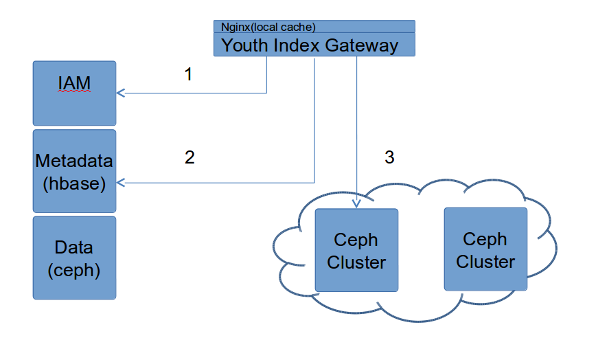

# Yig是一个S3 API兼容的对象存储系统，具有高可用性，高可靠性，理论上可以支持无限的用户和单bucket下无限的Object   

注释：目前测试的结果看至少支持百万级用户和单Bucket下存储数十亿文件.  

Core Features:  
  1. Put/MultiPartPut等object操作  
  2. ACL, 用户自定义attrs  
  3. S3 Auth V2/V4兼容  
  4. Object Version Support  
  5. 授权下载  
  6. 多线程下载  

# Overview  
    
主要分３层，  
IAM层负责用户校验和用户私钥的管理   
Metadata层负责   
1. 索引一个用户的所有bucket列表  
2. 索引单Bucket下所有的Object  
3. 索引记录在Multipart上传中的中间状态  
4. 记录异步删除的列表  
5. 记录Bucket和Object的ACL  
6. metadata层可以管理多个Cluster, 记录下层Data层中不同Cluster的静态权重  

metadata层可以管理多个Cluster, 记录下层Data层中不同Cluster的静态权重  

Data层负责具体的存储内容  
1. 实现用户数据的高可用性  
2. 提供大文件拆分，小文件聚合，把io/throughput均匀的分配到整个集群上面  
3. 目前Data层使用ceph集群，利用ceph集群提供的底层数据加密，单集群数据可靠性等  

# System Hardware  
hbase使用直连SSD硬盘，要求SSD硬盘的顺序写入>250MB/s, 随机写iops > 2w　由于会在hbase的服务器上  
安装hdfs, zookeeper，对内存的要求较高，需要至少128GB内存，CPU的情况需要后续册使  
ceph使用直连的SATA硬盘，内存>64GB, 测试SATA盘顺序写如>100MB/s, 随机写iops > 100  
单ceph集群内部使用万兆互联，保证在丢机器或者硬盘损坏做rebalance是，网络不会出现瓶颈  

# System Capacity  
N ==> Ceph集群个数  
C ==> 单Ceph集群物理容量  

# 容量  
单个object对应的元数据不会超过１K(参考hbase table schema), 所以集群的容量主要是取决与Ceph的容量  
 
3副本的情况  
N * (C / 3)  
EC的情况  
N*  (C / EC)  
 
在目前的硬件情况下,单集群200台，一台服务器12块6T硬盘，单集群３副本的情况下，可用存储  
C =(12*6T*200)/3= 4.8PB  
如果使用EC的集群，如果采用1.5  
C =(12*6T*200)/1.5= 9.6PB  
 
可见使用EC可以大幅度提高系统容量，可以在metadata层设定规则，把某些Bucket的冷数据放到EC集群，提高系统容量．  
单YIG系统可以异构的兼容EC和３副本的情况．  

# 性能  
写入流程  
1. 读取IAM,校验权限  
2. 数据写入Ceph集群  
3. 元数据写入hbase集群  

下载流程  
1. 读取IAM,校验权限  
2. 元数据读出hbase集群  
3. 数据读出Ceph集群  

其中访问IAM要求IAM的所有数据都cache在内存中，保证读取IAM的延迟控制在10ms以内．  
 
YIG系统的总的IOPS和总带宽可以随着服务器的增多而线性增长（在达到hbase的iops上限前),  
在达到了hbase的iops上限之后，需要增加hbase的服务器数量．  
 
## Ceph底层数据engine的选择：  
从目前社区的情况看，没有一个producton ready的底层engine可以同时满足小文件读写和大文件读写都能达到最佳的情况．从测试的情况看KStore在小于128K下的文件存储性能远远优于FileStore,  
而大于128K的文件，FileStore仍然有优势.　所以采取混合部署KStore和FileStore的策略．大于128K的文件进filestore.小于128K的文件进kstore  
   
IO模型分析: 无论FileStore还是KStore都有把随机写io变成顺序写io的策略，  
确别在于FileStore还有零星的随机写IO(但在yig的应用中都是大文件)  
   
根据目前测试结构定量计算：  
KStore的单硬盘目前可以提供200iops写4K小文件(需要进一步测试)，单小文件存储服务器可以提供12*200=2400 iops for 4k file  
FileStore大文件写入吞吐50MB/s(SATA盘100MB/s / 2, 2是由于FileStore写journal的损耗)  如果使用切分大文件，每４M切割成4片并发写入带宽理论上200MB/s, 实际测试在网络无瓶颈的情况下180MB/s  
单个大文件服务器可以提供至少12*50MB的600MB/s的吞吐, 注意这已经超过的千兆网卡的带宽，故而也需要万兆网卡  
利用底层ceph均匀hash的效果，可以把用户iops和throughput均匀的分配到整个集群，不会出现单机热点的情况，所以YIG系统的  
 
总iops  =  单机iops * 机器数量  
总吞吐 = 单机吞吐 * 机器数量  

这些在HBASE达到瓶颈前，都可以线性增长  

# System  Availability  
Yig的Gateway就是简单的http server, 可以线性扩展，无单点  
   
Hbase的跨AZ高可用:  
依赖与hdfs和zookeeper的高可用，zookeeper的跨AZ需要至少３个AZ, AZ之间的延迟小于10ms.  
hdfs的master和shadow master部署在不同的AZ, hdfs的3副本数据分配到多AZ.  
   
Ceph的跨AZ高可用:  
Ceph的monitor模块也至少需要３个AZ,  
Ceph的osd的3副本分配到多AZ  
   
YIG的Availlability计算  
SLO[YIG] = SLO[HBASE] * SLO[CEPH]  
相当与木桶原理，系统的Availability取决与SLO较低的那一个．  
   
从已有的数据和经验看这２个系统的SLO都是４个９，所以YIG系统的可用性也接近4个９  
  
# System Durability  
hdfs/ceph都是三副本，理论可靠性9个9, 部署采用３副本分到２个AZ, 比如一个AZ是２副本，  
另一个AZ一个副本，其中２副本也落在不同的机架上．  
  
# System Security  
采用多级的安全策略，即使黑客拿到硬盘，也无法得到用户数据  
1. 支持https  
2. 兼容S3的用户自定义secretkey  
3. 底层采用dm-crypt模块，在块设备层做加密  

# System Maintainability  
## 监控  
HBase/Ceph核心性能监控项.  
1. 总流量  
2. 总请求次数  
3. 请求延迟histogram表  
4. 硬盘iops/read/write(所有硬盘无热点，iops均匀分配)  
5. 当前容量  
  
由这些监控数据可以计算集群的saturability, 提前预警是否是iops能力不足还是硬盘物理容量不足．  
核心报警内容  
1. 网络partition  
2. 主机offline  
3. 硬盘offline  
  
日常维护和故障处理  
hbase的运维（TODO)  
ceph的运维 (ceph-operation-manual.md)  
  
## 上线原则  
1. critical bug 和　安全漏洞第一时间修复  
2. Feature上线参考google的Error Budgets原则，当系统的SLO达到足够gap时，才可以有新feature上线  

